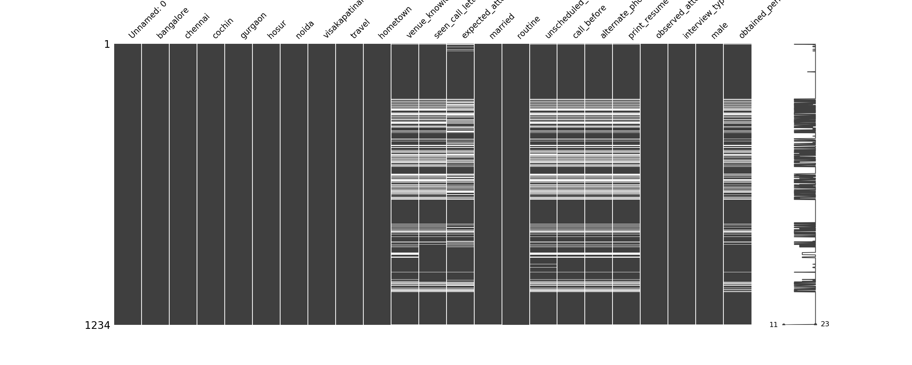
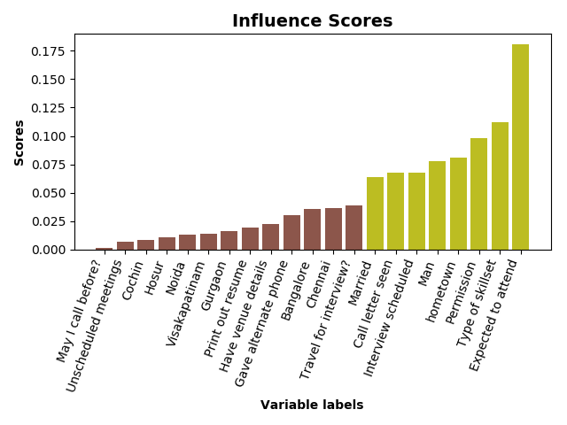

<h1> Interview Attendance Case Study </h1>

<h6>Team: Ryan Curry, Emily Quigley, Millie Smith, Jane Stout </h6>

<h3> Agenda </h3>
 10:00 - 10:30 Team meeting
 
 10:30 - 12:00 EDA which turned into leaning
 
 12:00 - 12:20 Team meeting to share results
 
 12:30 -  3:00 Modeling and analysis
 
 3:00  -  4:00 Markdown and GitHub

<h3> Data Cleaning </h3>
1. Broke columns and tasks out between the 4 of us for efficient cleaning
 
 
2. Retitled column names by removing spaces and creating shorter names
 
 
3. Explored data by using .unique() and .value_counts()
 
 
4. Simplified values by combining ["No","no","no "] into a single value
 
 
5. Converted to binary including dummy variables for columns such as location

<h3> Data Merging </h3>
To combine our separate files with the specific columns we worked on, we all exported our columns to our own CSV and then combined these together into a new dataframe. Upon merging we dropped our NaN values.
 
 

**Figure 1. Missing Values**

<h3> Modeling </h3>
1. Split into train and test
 
2. Stratified with respect to y in order to account for any class imbalance (63/36)
 
3. Started with Random Forest Classifier
 
4. Looked at the influence scores of the feature

**Figure 2. Influence scores**

5. Fit AdaBoost & Gradient Boosting Classifier to compare models
6. Calculated metrics for all models

   More false positives than false negatives. Predicted more people were going to show up than actually did.
 

|Metrics   |Score   |
|---|---|
|RFC OOB | 0.7289855072463768 |
|RFC Test | 0.7186147186147186 |
|RFC precision | 0.7438423645320197 |
|RFC recall | 0.9207317073170732 |
|ABC Test | 0.696969696969697 |
|ABC precision | 0.7373737373737373 |
|ABC recall | 0.8902439024390244 |
|Gradient Boosting Regressor Test | 0.7359307359307359 |
|Gradient Boosting Regressor precision | 0.7464114832535885 |
|Gradient Boosting Regressor recall | 0.9207317073170732 |
**Table 1. Metrics scores**
 

### Future Work
* Tuning the hyperparameters
* Determine how to handle NaN values
